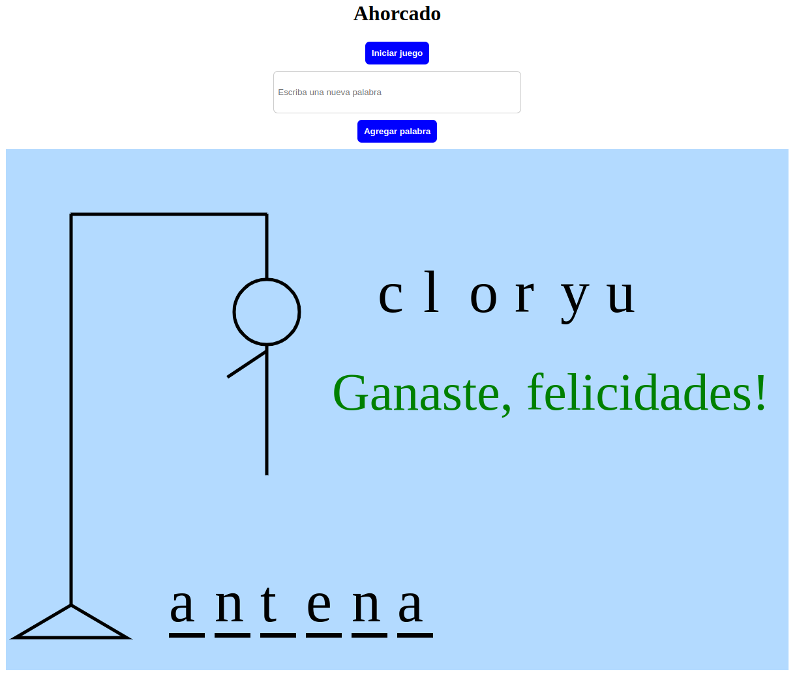

# Challenge2OneLogicaLatam_Ahorcado

### Página web del proyecto:

### https://miguelbada.github.io/Challenge2OneLogicaLatam_Ahorcado/

Juego del ahorcado 

Requisitos:
- Funciona sólo con letras mayúsculas;
- No deben ser utilizadas letras con acentos ni caracteres especiales;
- Al completar o dibujo de la horca, muestra un mensaje "Fin del juego" en la pantalla;
- Si se completa la palabra correcta antes de que se acaben los intentos, muestra un mensaje de "Ganaste, Felicidades!" en la pantalla.
- La página muestra guiones indicando cada letra de la palabra, separados por un espacio;
- Para comenzar el juego debe presionar elbotón de "Iniciar Juego";
- No es posible escribir números dentro del juego.
- Las letras equivocadas aparecen en la pantalla;
- Las letras correctas aparecen en la pantalla encima de los guiones, en la posición correcta con relación a la palabra.
- La página tiene un campo para inserción de texto con la finalidad de adicionar nuevas palabras al juego, y un botón de "Agregar palabra". Solo se deben agregar palabras antes del inicio del juego.

